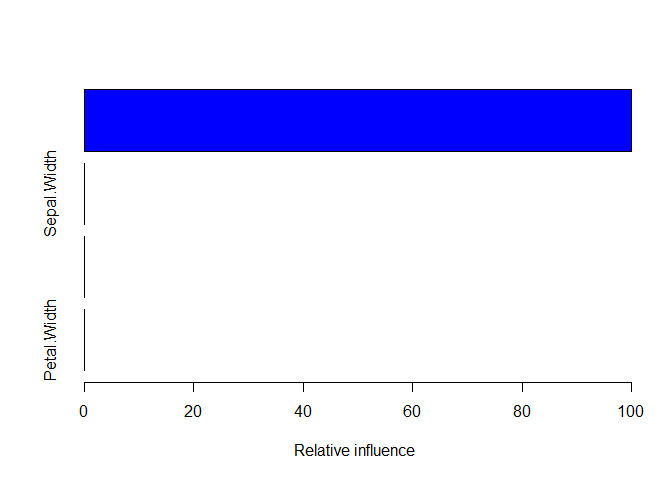
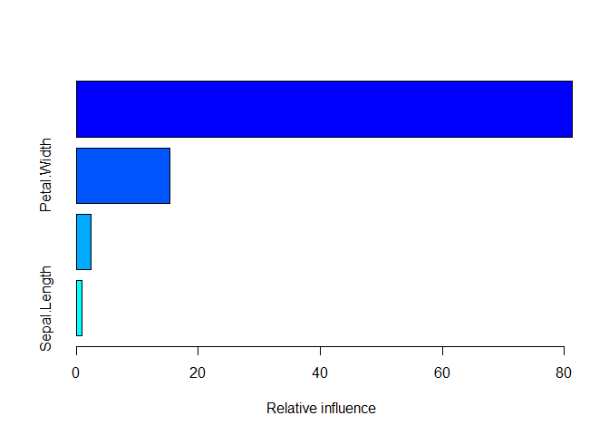

<!-- README.md is generated from README.Rmd. Please edit that file -->
Unified Machine Learning Language (mlLang)
==========================================

<!--
[](https://travis-ci.org/sfeuerriegel/mlLang)
[](https://cran.r-project.org/package=SentimentAnalysis)
[](https://codecov.io/github/sfeuerriegel/mlLang?branch=master)
-->
**mlLang** takes hold of the Unified Machine Learning Language (mlLang) inside R. We have developed **mlLang** as an XML-based, unified language for machine learning. It standardizes all relevant steps to train superior models: preprocessing operations, model specification, and the tuning process. It thereby makes model tuning reproducible and documents the underlying process.

This package ships the converter for R. For this purpose, it implements converters in two directions. (1) It automatically reads files in the unified machine learning language from custom XML files and then constructs a corresponding machine learning model in R. (2) It also supports the other direction and automatically converts machine learning models into XML files according to the unified machine learning language. All machine learning models are built on top of "caret".

Simply load **mlLang** when starting your programming session. Afterwards, all machine learning operations are recorded and written to the disk in an open XML format. This file can be later loaded to reproduce models and training processes from machine learning.

Overview
--------

The most important functions in **mlLang** are:

-   `parseMlTask(path)` converts XML files written in the Unified Machine Learning Language into R objects. Afterwards, `executeMlTask(model, data)` runs the corresponding training routines on the given data.

-   Additional function replace the training process for machine learning models in order to convert it into XML files following the Unified Machine Learning Language.

-   This package supports the main functionality as provided by the package `caret` for machine learning in R.

To see examples of these functions in use, check out the help pages, the demos and the vignette.

Installation
------------

Using the **devtools** package, you can easily install the latest development version of **mlLang** with

``` r
install.packages("devtools")

# Option 1: download and install latest version from ‘GitHub’
devtools::install_github("sfeuerriegel/mlLang/R")

# Option 2: install directly from bundled archive
# devtoos::install_local("mlLang_0.0.1.tar.gz")
```

Note: A CRAN version has not yet been released.

Usage
-----

This section shows the basic functionality of how to work with the Unified Machine Learning Language. First, load the corresponding package **mlLang**.

``` r
library(mlLang)
```

Parser: XML to R
----------------

The following code demonstrates some of the functionality provided by **mlLang**.

``` r
# sample data
data(iris)

# specify sample file
file <- system.file("XML", "iris_classification.xml", package = "mlLang")

# read task from unified machine learning language
task <- parseMlTask(file)

# train object with data
model <- executeMlTask(task, iris)
#> Parse XML file 
#> Data split: 
#> 0.5 
#> Preprocessings:  
#> center scale 
#> Validation parameters:  
#> method=repeatedcv;number=5;repeats=6 
#> Predictors:  Sepal.Length; numeric; Sepal.Width; numeric; Petal.Length; numeric; Petal.Width; numeric; 
#> Target:  Species; factor; 
#> Metric:  Accuracy 
#> Missing value handling:  
#> Plotting:  =;= 
#> Splitting data 
#> Begin training
#> Loading required package: gbm
#> Loading required package: survival
#> Loading required package: lattice
#> Loading required package: splines
#> Loading required package: parallel
#> Loaded gbm 2.1.1
#> Loading required package: plyr
#> Loading required package: ggplot2
#> 
#> Attaching package: 'caret'
#> The following object is masked from 'package:survival':
#> 
#>     cluster
#> Stochastic Gradient Boosting 
#> 
#> 75 samples
#>  4 predictor
#>  3 classes: 'setosa', 'versicolor', 'virginica' 
#> 
#> Pre-processing: centered (4), scaled (4) 
#> Resampling: Cross-Validated (5 fold, repeated 6 times) 
#> Summary of sample sizes: 60, 60, 60, 60, 60, 60, ... 
#> Resampling results across tuning parameters:
#> 
#>   shrinkage  n.trees  Accuracy   Kappa    
#>   0.1        1        0.8622222  0.7933333
#>   0.1        3        0.9111111  0.8666667
#>   0.1        4        0.9288889  0.8933333
#>   0.2        1        0.8777778  0.8166667
#>   0.2        3        0.8888889  0.8333333
#>   0.2        4        0.9044444  0.8566667
#> 
#> Tuning parameter 'interaction.depth' was held constant at a value of
#>  20
#> Tuning parameter 'n.minobsinnode' was held constant at a value of 10
#> Accuracy was used to select the optimal model using  the largest value.
#> The final values used for the model were n.trees = 4, interaction.depth
#>  = 20, shrinkage = 0.1 and n.minobsinnode = 10. 
#> 0.1 0.1 0.1 0.2 0.2 0.2 1 3 4 1 3 4 0.8622222 0.9111111 0.9288889 0.8777778 0.8888889 0.9044444 0.7933333 0.8666667 0.8933333 0.8166667 0.8333333 0.8566667 
#> Predict test data with default caret metric 
#> 0.6266667 0.44

summary(model)
```



    #>                       var  rel.inf
    #> Petal.Length Petal.Length 58.72545
    #> Petal.Width   Petal.Width 30.94658
    #> Sepal.Width   Sepal.Width 10.32797
    #> Sepal.Length Sepal.Length  0.00000

### Simultaneous execution of multiple tasks

``` r
library(tidyverse)
#> Loading tidyverse: tibble
#> Loading tidyverse: tidyr
#> Loading tidyverse: readr
#> Loading tidyverse: purrr
#> Loading tidyverse: dplyr
#> Conflicts with tidy packages ----------------------------------------------
#> arrange():   dplyr, plyr
#> compact():   purrr, plyr
#> complete():  tidyr, mice
#> count():     dplyr, plyr
#> failwith():  dplyr, plyr
#> filter():    dplyr, stats
#> id():        dplyr, plyr
#> lag():       dplyr, stats
#> lift():      purrr, caret
#> mutate():    dplyr, plyr
#> rename():    dplyr, plyr
#> summarise(): dplyr, plyr
#> summarize(): dplyr, plyr

set.seed(0)
in_train <- createDataPartition(iris$Species, p = 0.8, list = FALSE)

files <- list.files(system.file("XML", package = "mlLang"), 
                    pattern = "iris_classification(.*).xml",
                    full.names = TRUE)
models <- runMlTasks(files, iris[in_train, ], logger = NULL)

# best model
perf <- unlist(lapply(models, 
                      function(m) {
                        pred <- predict(m, newdata = iris[-in_train, ] %>% dplyr::select(-Species))
                        cm <- confusionMatrix(pred, iris[-in_train, "Species"])
                        return(cm$overall[["Accuracy"]])
                      }))
basename(files[which.max(perf)])
#> [1] "iris_classification_bootstrap.xml"
```

### Batch execution

``` r
library(BatchJobs)

reg <- makeRegistry(id = "mlLang")
ids <- scheduleMlTasks(reg, files, iris)

showStatus(reg)
```

``` r
# retrieve result for first model once completed
m1 <- loadResult(reg, 1)
```

Generator: R to XML
-------------------

``` r
set.seed(0)

data(iris)
predictors <- c("Sepal.Length", "Sepal.Width", "Petal.Length", "Petal.Width")

task <- newMlTask()

fitControl <- trainControl(method = "repeatedcv",
                           number = 10,
                           repeats = 3)

model <- task$train(x = iris[, predictors], y = iris$Species,
                    y_name = "Species",
                    method = "gbm",
                    preProcess = c("center", "scale"),
                    trControl = fitControl,
                    verbose = FALSE)

summary(model)
```



    #>                       var    rel.inf
    #> Petal.Length Petal.Length 81.3243434
    #> Petal.Width   Petal.Width 15.4038530
    #> Sepal.Width   Sepal.Width  2.4010636
    #> Sepal.Length Sepal.Length  0.8707399

    write(task, "iris_classification.xml")
    #> NULL
    unlink("iris_classification.xml")

XML syntax of the Unified Machine Learning Language
---------------------------------------------------

``` r
file_correct <- system.file("XML", "iris_classification.xml", package = "mlLang")
checkSchema(file_correct) # should work correctly
#> [1] TRUE

file_error <- system.file("XML", "iris_error.xml", package = "mlLang")
checkSchema(file_error) # should give a warning
#> Mode file does not satisfy XML schema:
#> * Error in line  25 :  Element 'test': This element is not expected. Expected is one of ( predictedVariable, MissingValueHandling ).
#> 
#> [1] FALSE
```

License
-------

**mlLang** is released under the [MIT License](https://opensource.org/licenses/MIT)

Copyright (c) 2016 Andreas Frorath & Stefan Feuerriegel
